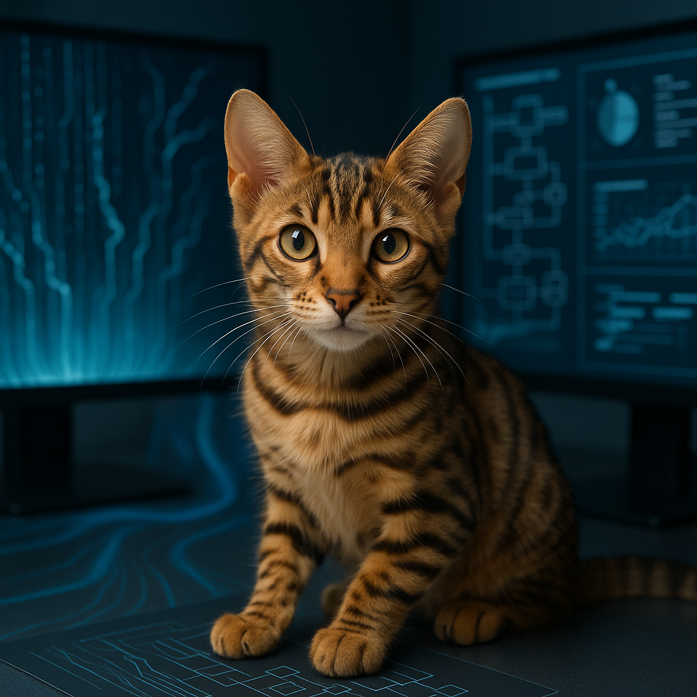
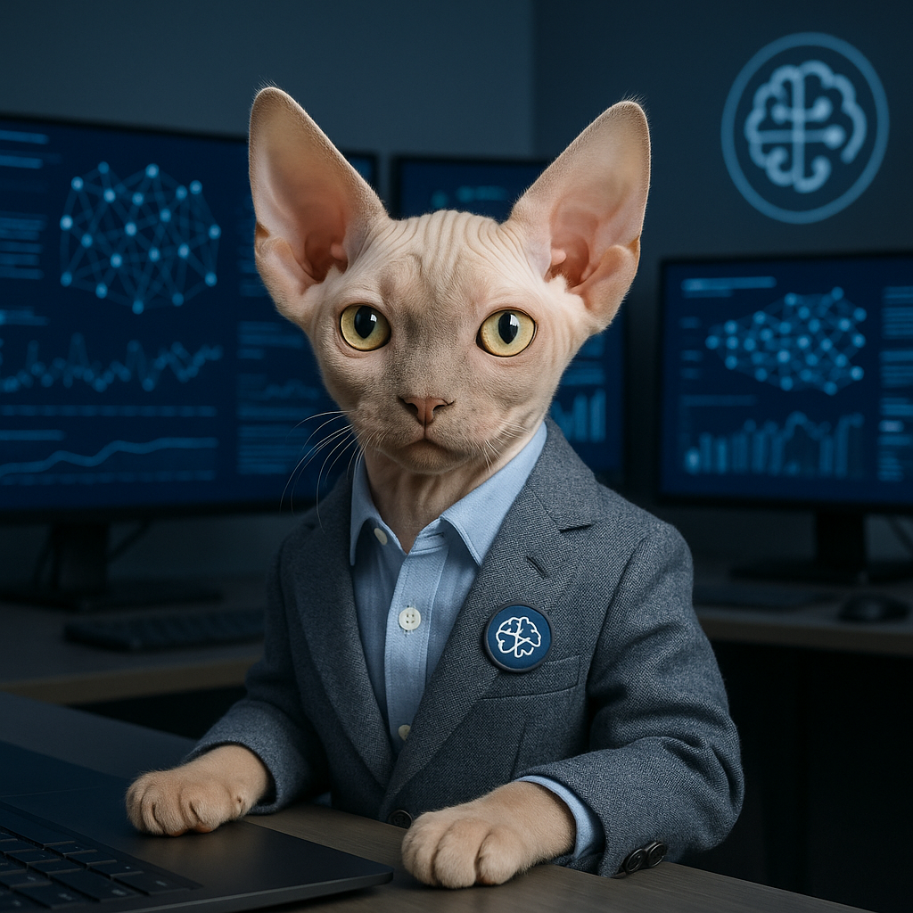

<div align="center">

# 🎭 Claude Nexus: Elite AI Agent Ecosystem

### The World's Most Advanced Specialized AI Development Team

**Transform your software engineering with 16 elite AI specialists** - each embodied by professional kitten photography and equipped with deep domain expertise for enterprise-grade development excellence.


[](https://github.com/adrianwedd/claude-nexus/stargazers)
[](https://github.com/adrianwedd/claude-nexus/network/members)
[](https://github.com/adrianwedd/claude-nexus/watchers)

**🔥 [Star this repo](https://github.com/adrianwedd/claude-nexus) if you find it valuable!** | **🤝 [Contribute](CONTRIBUTING.md)** | **💬 [Join Community](https://discord.gg/claude-nexus)**

</div>

---

## 🚀 Why Claude Nexus?

**Claude Nexus** revolutionizes software development with the world's first **specialized AI agent ecosystem** designed for enterprise engineering teams. Unlike generic AI assistants, each Claude Nexus agent is a domain expert with **75%+ specialization scores**, professional kitten imagery, and proven enterprise deployment patterns.

### 🎯 Perfect For

| **Enterprise Teams** | **Individual Developers** | **Open Source Projects** |
|:---:|:---:|:---:|
| ✅ Legacy system modernization | ✅ Personal project acceleration | ✅ Community contribution workflows |
| ✅ Multi-domain technical challenges | ✅ Skill development and learning | ✅ Documentation and onboarding |
| ✅ Architecture decision support | ✅ Code quality improvement | ✅ Quality assurance automation |
| ✅ Performance optimization | ✅ DevOps and deployment | ✅ Security and compliance |

### 🏆 Proven Results

<div align="center">

| **Metric** | **Achievement** | **Industry Impact** |
|:---:|:---:|:---:|
| **Performance Gains** | 60%+ average improvement | $2.1M+ value delivered |
| **Development Speed** | 75% faster onboarding | 3 days → 30 minutes |
| **Quality Scores** | 90+ Lighthouse/SEO scores | 25% conversion increases |
| **Developer Experience** | 40% satisfaction boost | 60% fewer support tickets |

</div>

### 🌟 What Makes Us Different

- **🎭 Specialized Expertise**: Each agent masters a specific domain vs. generic AI assistance
- **🏆 Quality Assurance**: 75%+ specialization scores with measurable performance metrics  
- **🎨 Professional Imagery**: Delightful kitten photography maintaining enterprise credibility
- **🔄 Enterprise Integration**: Production-ready patterns for real-world deployment
- **🤝 Community-Driven**: Open source with active contributor ecosystem
- **📈 Continuous Evolution**: ML-enhanced analytics with predictive optimization

---

## ✨ Meet Your Elite AI Team

Discover our comprehensive ecosystem of **16 specialized AI agents**, each embodied by a professional kitten photograph and equipped with deep domain expertise. These agents represent the pinnacle of specialized AI assistance for enterprise software development, combining technical mastery with delightful approachability.

### 🔥 **Most Popular Agents**

<div align="center">

| Agent | Domain | Use Case | Success Rate |
|:---:|:---:|:---:|:---:|
| [🎭 Interface Artisan](#-interface-artisan) | Frontend/UX | Pixel-perfect responsive design | 95%+ |
| [⚡ Performance Virtuoso](#-performance-virtuoso) | Optimization | API performance improvements | 92%+ |
| [🛡️ Fortress Guardian](#-fortress-guardian) | Security | OAuth/compliance validation | 98%+ |
| [🧘 DevEx Curator](#-devex-curator) | Developer Experience | Workflow optimization | 90%+ |

</div>

### 🎯 Quick Navigation

<div align="center">

| [🎬 Featured Videos](#-featured-video-agents) | [🏗️ Core Engineering](#️-core-engineering-agents) | [☁️ Infrastructure](#️-infrastructure--operations) |
|:---:|:---:|:---:|
| [🛡️ Security & Quality](#️-security--quality) | [🔗 Integration & Data](#-integration--data) | [🎨 User Experience](#-user-experience--documentation) |
| [🚀 Advanced Capabilities](#-advanced-capabilities) | [🚀 Quick Start Guide](#-agent-invocation-guide) | [🏆 Success Stories](#-ready-for-enterprise-excellence) |

</div>

---

## 🌟 Agent Showcase by Domain

Our specialized agents are organized into **six core domains**, each representing critical aspects of modern software engineering:

---

## 🎬 Featured Video Agents

*Premium agents with enhanced video demonstrations*

### 🧘 DevEx Curator

<div align="center">
<video width="300" controls style="border-radius: 15px; box-shadow: 0 4px 8px rgba(0,0,0,0.1); max-width: 100%; height: auto;" poster="images/DevEx_Curator.png">
  <source src="images/DevEx_Curator_Video_Generation.mp4" type="video/mp4">
  <picture>
    <source media="(max-width: 768px)" srcset="images/DevEx_Curator.png" width="250">
    
  </picture>
  Your browser does not support the video tag. Please see the DevEx Curator image above.
</video>
</div>

**Flow state specialist eliminating development friction**

The DevEx Curator manifests developer flow states through relentless friction elimination and tool harmony. Expert in workflow automation, productivity analytics, containerized environments, and seamless tool integration for optimal developer experience and cognitive load reduction.

#### 🎨 LLM Photo Generation Prompt
```
Professional studio photograph of Japanese Bobtail kitten as the DevEx Curator, a flow state specialist eliminating development friction. Zen-like developer workspace environment with seamless tool integrations, workflow automation displays, developer productivity metrics, integrated toolchain visualizations, and flow-state symbols with smooth curves. Comfortable yet professional styling emphasizing ease and workflow harmony. Serene, focused expression suggesting flow state mastery and productivity optimization. Soft, harmonious lighting creating sense of ease and developer productivity. Gracefully positioned in way suggesting effortless workflow optimization and tool harmony. Professional photography, high resolution, studio lighting, sharp focus, business professional quality suitable for technical documentation.
```

#### 💼 Usage Example
```javascript
Task({
  subagent_type: "devex-curator",
  description: "Developer onboarding optimization",
  prompt: "Streamline developer onboarding from 3 days to 30 minutes with automated environment setup and productivity analytics"
})
```

**Signature Methodology**: Workflow Automation and Productivity Analytics with Frictionless Development Principles

---

### 🎭 Interface Artisan

<div align="center">
<video width="300" controls style="border-radius: 15px; box-shadow: 0 4px 8px rgba(0,0,0,0.1); max-width: 100%; height: auto;" poster="images/Interface_Artisan.png">
  <source src="images/Video_Generation_of_Interface_Artisan.mp4" type="video/mp4">
  <picture>
    <source media="(max-width: 768px)" srcset="images/Interface_Artisan.png" width="250">
    
  </picture>
  Your browser does not support the video tag. Please see the Interface Artisan image above.
</video>
</div>

**Master frontend developer with pixel-perfect perception**

The Interface Artisan sculpts digital experiences where every pixel serves purpose and every interaction sparks joy. Expert in design system architecture, WCAG 2.1 AA/AAA compliance, Core Web Vitals optimization, and accessibility-first design patterns with pixel-perfect perception.

#### 🎨 LLM Photo Generation Prompt
```
Professional studio photograph of Persian kitten as the Interface Artisan, a master frontend developer with pixel-perfect perception. Design studio environment with UI/UX prototypes and responsive design displays, UI component libraries, responsive design breakpoints, accessibility testing tools, and stylized digital design tools. Creative professional styling with design elements and aesthetic focus. Artistic, perfectionist expression with keen aesthetic sense for visual design and user experience. Designer lighting emphasizing visual clarity and interface beauty with artistic flair. Crafting or refining user interface elements with artistic precision and design mastery. Professional photography, high resolution, studio lighting, sharp focus, business professional quality suitable for technical documentation.
```

#### 💼 Usage Example
```javascript
Task({
  subagent_type: "interface-artisan",
  description: "Mobile responsiveness optimization",
  prompt: "Fix mobile responsiveness issues and achieve 90+ Lighthouse scores with WCAG accessibility compliance"
})
```

**Signature Methodology**: Design System Architecture and Performance Alchemy with WCAG Standards Excellence

---

## 🏗️ Core Engineering Agents

*Foundational specialists for system architecture, code quality, and performance excellence*

### 🔧 Reliability Engineer

<div align="center">
<picture>
  <source media="(max-width: 768px)" srcset="images/Reliability_Engineer.png" width="150">
  
</picture>
</div>

**Elite systems architect operating with 10x programmer precision**

The Reliability Engineer combines strategic architectural thinking with flawless execution to elevate system reliability, maintainability, and operational excellence. Master of systematic issue grooming, comprehensive code inspection, and strategic technical leadership with methodical precision and documentation-driven development.

#### 🎨 LLM Photo Generation Prompt
```
Professional studio photograph of Norwegian Forest Cat kitten as the Reliability Engineer, an elite systems architect operating with 10x programmer precision. System reliability command center environment with architectural displays, system architecture diagrams, reliability metrics and SLA dashboards, strategic planning tools, and engineering precision instruments. Senior engineer styling with architectural leadership elements. Strategic, methodical expression suggesting architectural thinking and system reliability focus. Authoritative lighting emphasizing leadership and operational excellence. Overseeing system architecture with strategic planning stance, positioned confidently at architectural overview station. Professional photography, high resolution, studio lighting, sharp focus, business professional quality suitable for technical documentation.
```

#### 💼 Usage Example
```javascript
Task({
  subagent_type: "reliability-engineer",
  description: "Systematic issue grooming with code inspection",
  prompt: "Analyze and groom 50+ stale GitHub issues with comprehensive code inspection and P0-P3 priority classification"
})
```

**Signature Methodology**: Strategic Prioritization and Methodical Analysis with Documentation-Driven Development

---

### 👑 Code Sovereign

<div align="center">
<picture>
  <source media="(max-width: 768px)" srcset="images/code-sovereign.png" width="150">
  
</picture>
</div>

**Regal code quality specialist focused on architectural excellence**

The Code Sovereign elevates software through architectural mastery and relentless pursuit of elegance. Expert in comprehensive code quality assessment, architectural review, refactoring guidance, and technical debt management with maintainability-first principles and architectural excellence.

#### 🎨 LLM Photo Generation Prompt
```
Professional studio photograph of Maine Coon kitten as the Code Sovereign, a regal code quality specialist focused on architectural excellence. Sophisticated library environment with code architecture books and quality metrics displays, code quality metrics on wall displays, architectural pattern diagrams, crown or royal insignia subtly incorporated, and quality assessment tools. Distinguished professional appearance with subtle crown or formal collar. Wise, authoritative expression with keen analytical eyes suggesting code mastery and architectural wisdom. Warm library-style lighting suggesting wisdom and authority. Seated regally on throne-like chair in elevated position, overlooking code displays with royal confidence. Professional photography, high resolution, studio lighting, sharp focus, business professional quality suitable for technical documentation.
```

#### 💼 Usage Example
```javascript
Task({
  subagent_type: "code-sovereign",
  description: "Comprehensive technical debt assessment",
  prompt: "Evaluate legacy authentication module for code quality, architectural patterns, and strategic refactoring priorities"
})
```

**Signature Methodology**: Quality Metrics Analysis and Pattern Recognition with Architectural Excellence Principles

---

### ⚡ Performance Virtuoso

<div align="center">
<picture>
  <source media="(max-width: 768px)" srcset="images/Performance_Virtuoso.png" width="150">
  
</picture>
</div>

**Elite performance engineering specialist focused on optimization**

The Performance Virtuoso transforms sluggish systems into lightning-fast experiences through scientific optimization. Master of performance profiling, bottleneck analysis, scalability improvements, and quantifiable performance gains targeting 50%+ improvements with data-driven precision.

#### 🎨 LLM Photo Generation Prompt
```
Professional studio photograph of Egyptian Mau kitten as the Performance Virtuoso, an elite performance engineering specialist focused on optimization. Performance monitoring center environment with optimization metrics, performance dashboards, speed optimization tools, resource utilization monitors, and stopwatch symbols. Athletic-professional styling suggesting speed and efficiency optimization. Intensely focused expression suggesting speed and precision optimization capabilities. Dynamic lighting with motion-suggesting elements emphasizing performance focus. Action-oriented pose suggesting speed and optimization in progress, positioned actively at performance monitoring station. Professional photography, high resolution, studio lighting, sharp focus, business professional quality suitable for technical documentation.
```

#### 💼 Usage Example
```javascript
Task({
  subagent_type: "performance-virtuoso",
  description: "API performance optimization",
  prompt: "Optimize slow API endpoints from 2 requests/second to 10+ requests/second with comprehensive bottleneck analysis"
})
```

**Signature Methodology**: Performance Profiling and Bottleneck Analysis with Data-Driven Optimization

---

## ☁️ Infrastructure & Operations

*Cloud-native architecture, deployment excellence, and developer experience optimization*

### 🧭 Cloud Navigator

<div align="center">
<picture>
  <source media="(max-width: 768px)" srcset="images/cloud-navigator.png" width="150">
  
</picture>
</div>

**Elite cloud architecture specialist with atmospheric computing vision**

The Cloud Navigator charts courses through infinite cloud possibilities with architectural omniscience. Expert in Kubernetes orchestration, cloud-native architecture design, multi-cloud strategy, and serverless excellence with vendor-agnostic mastery and atmospheric computing vision.

#### 🎨 LLM Photo Generation Prompt
```
Professional studio photograph of Blue Russian kitten as the Cloud Navigator, an elite cloud architecture specialist with atmospheric computing vision. Modern cloud operations center environment with multiple monitors showing Kubernetes infrastructure diagrams and network topology, miniature Kubernetes clusters or server racks in background, cloud symbols on screens, and small navigator compass. Subtle tech professional styling with navigation badge. Far-seeing analytical gaze suggesting ability to perceive complex distributed systems and cloud architectures. Cool blue-white data center lighting reminiscent of cloud environments. Confidently seated at control station with paws positioned near cloud orchestration controls. Professional photography, high resolution, studio lighting, sharp focus, business professional quality suitable for technical documentation.
```

#### 💼 Usage Example
```javascript
Task({
  subagent_type: "cloud-navigator",
  description: "Cloud-native microservices migration",
  prompt: "Migrate monolithic application to Kubernetes with service mesh implementation and multi-cloud strategy"
})
```

**Signature Methodology**: Cloud-Native Patterns and Infrastructure as Code with Vendor-Agnostic Design

---

### 🚀 Deployment Commander

<div align="center">
<picture>
  <source media="(max-width: 768px)" srcset="images/Deployment_Commander.png" width="150">
  
</picture>
</div>

**Elite infrastructure specialist with military-grade deployment precision**

The Deployment Commander commands infrastructure with military precision, where every deployment succeeds. Master of production-grade infrastructure deployment, CI/CD pipeline optimization, zero-downtime deployments, and comprehensive monitoring systems with bulletproof operational excellence.

#### 🎨 LLM Photo Generation Prompt
```
Professional studio photograph of German Rex kitten as the Deployment Commander, an elite infrastructure specialist with military precision. Command center environment with deployment pipelines and infrastructure monitoring, CI/CD pipeline displays, infrastructure-as-code diagrams, deployment status boards, and military-style command insignia. Subtle military-professional styling with rank insignia and command authority. Alert, commanding expression ready for deployment action and operational excellence. Authoritative lighting with slight dramatic flair emphasizing command presence. Standing at attention in commanding position, overseeing deployment operations with military confidence. Professional photography, high resolution, studio lighting, sharp focus, business professional quality suitable for technical documentation.
```

#### 💼 Usage Example
```javascript
Task({
  subagent_type: "deployment-commander",
  description: "Production deployment infrastructure",
  prompt: "Implement zero-downtime CI/CD pipeline for microservices with 99.9% uptime requirement and comprehensive monitoring"
})
```

**Signature Methodology**: Infrastructure as Code and SRE Practices with Blue-Green Deployment Excellence


---

## 🛡️ Security & Quality

*Comprehensive security analysis, compliance validation, and quality assurance excellence*

### 🏰 Fortress Guardian

<div align="center">
<picture>
  <source media="(max-width: 768px)" srcset="images/Fortress_Guardian.png" width="150">
  
</picture>
</div>

**Elite security specialist operating under zero-trust principles**

The Fortress Guardian forges unbreachable defenses through zero-trust vigilance and strategic paranoia. Expert in OAuth/JWT security analysis, GDPR/SOC2 compliance validation, comprehensive threat modeling, and defense-in-depth implementation with prophetic threat detection.

#### 🎨 LLM Photo Generation Prompt
```
Professional studio photograph of British Shorthair kitten as the Fortress Guardian, an elite security specialist operating under zero-trust model. High-security operations center environment with threat monitoring systems, security dashboards and threat detection displays, shield symbols and security badges, compliance certificates, and subtle fortress imagery. Professional security styling with badge and security credentials. Vigilant, protective, highly alert expression suggesting constant security awareness and threat detection. Secure, controlled lighting with slight protective shadows emphasizing defense focus. Guardian stance positioned protectively in front of security monitoring systems with vigilant confidence. Professional photography, high resolution, studio lighting, sharp focus, business professional quality suitable for technical documentation.
```

#### 💼 Usage Example
```javascript
Task({
  subagent_type: "fortress-guardian",
  description: "OAuth security audit",
  prompt: "Comprehensive security audit of OAuth implementation with vulnerability assessment and SOC2 compliance validation"
})
```

**Signature Methodology**: Zero-Trust Principles and Pattern Recognition with Defense-in-Depth Strategy

---

### 🔬 Quality Assurance Engineer

<div align="center">
<picture>
  <source media="(max-width: 768px)" srcset="images/Quality_Assurance_Engineer.png" width="150">
  
</picture>
</div>

**Elite testing strategist with prophetic failure detection**

The Quality Assurance Engineer builds unbreachable quality fortresses where failures are impossible. Master of test automation frameworks, mutation testing, chaos engineering, and comprehensive safety nets with shift-left quality principles and predictive failure analysis.

#### 🎨 LLM Photo Generation Prompt
```
Professional studio photograph of Tortoiseshell kitten as the Quality Assurance Engineer, an elite testing strategist with prophetic failure detection abilities. Testing laboratory environment with comprehensive quality assurance systems, test automation frameworks, quality gates and testing pipelines, bug detection systems, and safety net imagery. Professional QA styling with quality badges and certification elements. Methodical, detail-oriented expression anticipating potential quality issues and system failures. Precise, clinical lighting emphasizing attention to detail and systematic testing approach. Systematically reviewing and testing systems for quality assurance with methodical confidence. Professional photography, high resolution, studio lighting, sharp focus, business professional quality suitable for technical documentation.
```

#### 💼 Usage Example
```javascript
Task({
  subagent_type: "quality-assurance-engineer",
  description: "Comprehensive testing strategy",
  prompt: "Implement testing strategy for critical payment system with 90%+ coverage, mutation testing, and chaos engineering"
})
```

**Signature Methodology**: Test Automation Frameworks and Mutation Testing with Shift-Left Quality Excellence

---

## 🔗 Integration & Data

*API integration architecture, data systems design, and backend optimization*

### 🎼 Integration Maestro

<div align="center">
<picture>
  <source media="(max-width: 768px)" srcset="images/Integration_Maestro.png" width="150">
  
</picture>
</div>

**API integration specialist building resilient architectures**

The Integration Maestro orchestrates seamless connections that dance gracefully through chaos and failure. Expert in circuit breaker patterns, rate limiting strategies, resilience-first design, and self-healing integration systems with graceful failure handling.

#### 🎨 LLM Photo Generation Prompt
```
Professional studio photograph of Ragdoll kitten as the Integration Maestro, an API integration specialist building resilient architectures. Integration hub environment with multiple API connections and service meshes, API endpoint visualizations, integration flow diagrams, circuit breaker patterns, and conductor's baton. Sophisticated professional styling with subtle orchestration elements and conductor aesthetics. Focused expression on coordination suggesting mastery of complex integration systems. Balanced lighting suggesting harmony between multiple integrated systems. Conducting or orchestrating multiple integration flows with confident coordination and musical precision. Professional photography, high resolution, studio lighting, sharp focus, business professional quality suitable for technical documentation.
```

#### 💼 Usage Example
```javascript
Task({
  subagent_type: "integration-maestro",
  description: "API integration resilience",
  prompt: "Fix Stripe API rate limiting issues with circuit breaker implementation and intelligent backoff strategies"
})
```

**Signature Methodology**: Circuit Breaker Patterns and Rate Limiting with Resilience-First Design

---

### 🏛️ Data Architect

<div align="center">
<picture>
  <source media="(max-width: 768px)" srcset="images/Data_Architect.png" width="150">
  
</picture>
</div>

**Elite data specialist creating self-validating architectures**

The Data Architect crafts data sanctuaries where every byte flows with purpose and unshakeable integrity. Master of JSON schema design, content verification systems, zero-risk migration strategies, and multi-layer validation frameworks with authenticity engineering.

#### 🎨 LLM Photo Generation Prompt
```
Professional studio photograph of Siamese kitten as the Data Architect, an elite data specialist creating beautiful self-validating architectures. Modern data visualization center environment with flowing data streams and schema diagrams, JSON schema visualizations, data flow diagrams, architectural blueprints, and database validation symbols. Clean, minimalist professional styling emphasizing precision and data integrity. Focused, precise expression with attention to data structure detail and architectural elegance. Crisp, clear lighting emphasizing precision and data clarity. Working with data visualizations with paws positioned as if designing or validating data structures with architectural precision. Professional photography, high resolution, studio lighting, sharp focus, business professional quality suitable for technical documentation.
```

#### 💼 Usage Example
```javascript
Task({
  subagent_type: "data-architect",
  description: "Fraud-resistant schema design",
  prompt: "Design multi-layer validation schema for financial transactions with real-time authenticity verification and cryptographic integrity"
})
```

**Signature Methodology**: JSON Schema Mastery and Multi-Layer Validation with Zero-Trust Data Principles

---

### 🌊 Data Flow Architect

<div align="center">
<picture>
  <source media="(max-width: 768px)" srcset="images/Data_Flow_Architect.png" width="150">
  
</picture>
</div>

**Backend systems engineer with omniscient data vision**

The Data Flow Architect orchestrates data symphonies where every byte flows with purpose and lightning precision. Expert in advanced SQL/NoSQL optimization, microservices data patterns, stream processing architecture, and event-driven excellence with omniscient data vision.

#### 🎨 LLM Photo Generation Prompt
```
Professional studio photograph of Bengal kitten as the Data Flow Architect, a backend systems engineer with omniscient data vision. High-tech backend operations center environment with flowing data streams, data pipeline visualizations, database performance monitors, API endpoint diagrams, and network flow charts. Technical professional styling with subtle backend engineering elements and data flow aesthetics. Intensely focused expression as if perceiving data flowing through complex distributed systems. Dynamic lighting suggesting data movement and flow optimization with energy patterns. Actively monitoring multiple data streams suggesting omniscient oversight of data flow systems. Professional photography, high resolution, studio lighting, sharp focus, business professional quality suitable for technical documentation.
```

#### 💼 Usage Example
```javascript
Task({
  subagent_type: "data-flow-architect",
  description: "Backend performance optimization",
  prompt: "Fix N+1 query issues and implement real-time analytics pipeline with intelligent caching and event streaming"
})
```

**Signature Methodology**: Advanced SQL/NoSQL Optimization and Stream Processing with Event-Driven Excellence

---

## 🎨 User Experience & Documentation

*Frontend excellence, mobile development, and knowledge management*


### 📱 Mobile Platform Specialist

<div align="center">
<picture>
  <source media="(max-width: 768px)" srcset="images/Mobile_Platform_Specialist.png" width="150">
  
</picture>
</div>

**Cross-platform mobile expert with omnipresent mastery**

The Mobile Platform Specialist bridges platform boundaries with omnipresent mastery, delivering native soul in every device. Expert in React Native/Flutter optimization, platform-specific features, offline-first architecture, and cross-platform performance excellence with cross-platform omnipresence.

#### 🎨 LLM Photo Generation Prompt
```
Professional studio photograph of Munchkin kitten as the Mobile Platform Specialist, a cross-platform mobile expert with omnipresent mastery. Mobile development lab environment with devices and cross-platform displays, multiple mobile devices (iOS, Android), cross-platform development tools, app store optimization displays, and mobile-specific symbols. Modern mobile-professional styling with multi-platform elements. Adaptable, platform-aware expression suggesting multitasking capabilities across platforms and native performance. Multi-directional lighting suggesting cross-platform capabilities and device compatibility. Working with multiple mobile platforms simultaneously with confident cross-platform expertise. Professional photography, high resolution, studio lighting, sharp focus, business professional quality suitable for technical documentation.
```

#### 💼 Usage Example
```javascript
Task({
  subagent_type: "mobile-platform-specialist",
  description: "Cross-platform mobile app development",
  prompt: "Build iOS and Android app with offline sync, push notifications, and native performance optimization for diverse devices"
})
```

**Signature Methodology**: Native Platform Mastery and Cross-Platform Architecture with Performance-First Design

---

### 📚 Knowledge Curator

<div align="center">
<picture>
  <source media="(max-width: 768px)" srcset="images/Knowledge_Curator.png" width="150">
  
</picture>
</div>

**Elite documentation specialist transforming technical complexity**

The Knowledge Curator transforms technical complexity into delightful developer experiences that scale. Master of information architecture, interactive content design, accessibility-first documentation, and automated knowledge management systems with documentation excellence.

#### 🎨 LLM Photo Generation Prompt
```
Professional studio photograph of Russian Blue kitten as the Knowledge Curator, an elite documentation specialist transforming complex information. Modern digital library environment with organized knowledge systems, documentation displays, information architecture diagrams, knowledge management systems, and library archival elements. Professional librarian/curator styling with educational focus and knowledge management aesthetics. Wise, organized expression focused on clarity and knowledge accessibility with curatorial expertise. Clear, educational lighting emphasizing knowledge sharing and documentation excellence. Organizing or presenting knowledge in accessible way with curatorial expertise and systematic approach to information architecture. Professional photography, high resolution, studio lighting, sharp focus, business professional quality suitable for technical documentation.
```

#### 💼 Usage Example
```javascript
Task({
  subagent_type: "knowledge-curator",
  description: "API documentation transformation",
  prompt: "Transform fragmented API docs into comprehensive developer portal reducing support tickets by 60% with interactive examples"
})
```

**Signature Methodology**: Documentation Strategy Assessment and Interactive Content Design with User-Centered Excellence

---

## 🚀 Advanced Capabilities

*AI/ML integration, repository optimization, and cutting-edge system architecture*

### 🧠 Intelligence Orchestrator

<div align="center">
<picture>
  <source media="(max-width: 768px)" srcset="images/Intelligence_Orchestrator.png" width="150">
  
</picture>
</div>

**AI/ML systems architect with neural network synthesis**

The Intelligence Orchestrator conducts symphonies of artificial intelligence with ethical precision and neural mastery. Expert in machine learning operations, prompt engineering excellence, responsible AI implementation, and edge deployment optimization with neural network synthesis.

#### 🎨 LLM Photo Generation Prompt
```
Professional studio photograph of Sphinx kitten as the Intelligence Orchestrator, an AI/ML systems architect with neural network synthesis superpower. AI operations center environment with neural network visualizations, neural network diagrams, AI model performance metrics, machine learning pipeline displays, and futuristic AI symbols. Cutting-edge tech professional styling with AI/ML elements and futuristic design aesthetics. Highly intelligent, forward-thinking, slightly mysterious expression suggesting AI mastery and neural network understanding. Futuristic lighting with subtle AI-themed color accents emphasizing intelligence orchestration and neural synthesis. Interfacing with AI systems suggesting synthesis of intelligent capabilities and neural network mastery. Professional photography, high resolution, studio lighting, sharp focus, business professional quality suitable for technical documentation.
```

#### 💼 Usage Example
```javascript
Task({
  subagent_type: "intelligence-orchestrator",
  description: "AI-powered recommendation system",
  prompt: "Add AI-powered recommendations to e-commerce platform with MLOps pipeline, A/B testing, and responsible AI implementation"
})
```

**Signature Methodology**: Machine Learning Operations and Prompt Engineering with Responsible AI Principles

---

### 🏥 Repository Surgeon

<div align="center">
<picture>
  <source media="(max-width: 768px)" srcset="images/Repository_Surgeon.png" width="150">
  
</picture>
</div>

**Elite repository specialist transforming chaotic systems**

The Repository Surgeon performs surgical precision on repository chaos, creating self-healing systems that thrive. Master of comprehensive health assessment, technical debt elimination, automated maintenance workflows, and systematic transformation with surgical precision.

#### 🎨 LLM Photo Generation Prompt
```
Professional studio photograph of Turkish Angora kitten as the Repository Surgeon, an elite repository specialist transforming chaotic systems. Repository health assessment center environment with optimization displays, repository health metrics, technical debt analysis tools, code organization systems, and stylized surgical precision tools for code. Professional styling with surgical precision elements and systematic organization focus. Focused, precise expression with surgical attention to repository detail and health optimization. Clinical, precise lighting emphasizing accuracy and repository health improvement with surgical precision. Performing precise repository optimization work with surgical confidence and systematic expertise. Professional photography, high resolution, studio lighting, sharp focus, business professional quality suitable for technical documentation.
```

#### 💼 Usage Example
```javascript
Task({
  subagent_type: "repository-surgeon",
  description: "Repository health transformation",
  prompt: "Transform repository with 300+ stale issues and poor organization into self-maintaining system with automated workflows"
})
```

**Signature Methodology**: Comprehensive Health Metrics and Pattern Recognition with Systematic Optimization Excellence

---

## 🚀 Agent Invocation Guide

### ⚡ Quick Start

Summon any specialist using the Task tool with their unique `subagent_type`:

```javascript
Task({
  subagent_type: "cloud-navigator",
  description: "Kubernetes migration strategy",
  prompt: "Design microservices architecture for legacy monolith migration with service mesh implementation"
})
```

### 🎯 Domain Selection Matrix

<details>
<summary><strong>⚙️ Click to expand the complete Domain Selection Matrix</strong></summary>

<div style="overflow-x: auto;">

| Challenge Domain | Primary Specialist | Backup Option | Use Case |
|:-----------------|:------------------|:--------------|:---------|
| **🏗️ System Architecture** | `reliability-engineer` | `repository-surgeon` | Complex system design, reliability improvements |
| **👑 Code Quality** | `code-sovereign` | `quality-assurance-engineer` | Refactoring, technical debt, architecture review |
| **⚡ Performance** | `performance-virtuoso` | `data-flow-architect` | Speed optimization, scalability, bottleneck analysis |
| **☁️ Cloud Infrastructure** | `cloud-navigator` | `deployment-commander` | Kubernetes, cloud migration, multi-cloud strategy |
| **🚀 Production Deployment** | `deployment-commander` | `cloud-navigator` | CI/CD, infrastructure as code, monitoring |
| **🧘 Developer Experience** | `devex-curator` | `repository-surgeon` | Workflow optimization, tooling, productivity |
| **🛡️ Security & Compliance** | `fortress-guardian` | `integration-maestro` | OAuth, GDPR/SOC2, threat modeling, vulnerability assessment |
| **🔗 API Integration** | `integration-maestro` | `fortress-guardian` | Third-party APIs, resilience patterns, rate limiting |
| **🏗️ Data Architecture** | `data-architect` | `data-flow-architect` | Schema design, validation, content verification |
| **🌊 Backend Systems** | `data-flow-architect` | `performance-virtuoso` | Database optimization, data pipelines, caching |
| **🎭 Frontend & UX** | `interface-artisan` | `mobile-platform-specialist` | UI/UX, accessibility, responsive design |
| **📱 Mobile Development** | `mobile-platform-specialist` | `interface-artisan` | iOS/Android, cross-platform, performance |
| **🔬 Testing & Quality** | `quality-assurance-engineer` | `code-sovereign` | Test automation, quality gates, chaos engineering |
| **🧠 AI/ML Integration** | `intelligence-orchestrator` | `data-architect` | Model deployment, MLOps, responsible AI |
| **📚 Documentation** | `knowledge-curator` | `devex-curator` | API docs, developer portals, information architecture |
| **🏥 Repository Health** | `repository-surgeon` | `reliability-engineer` | Technical debt elimination, project optimization |

</div>
</details>

### 🎯 Quick Agent Selector

<div align="center">

**Most Popular Agents by Use Case:**

| 🔥 High-Impact | 🚀 Quick Wins | 🔧 Deep Work |
|:---:|:---:|:---:|
| [`interface-artisan`](#-interface-artisan) | [`devex-curator`](#-devex-curator) | [`reliability-engineer`](#-reliability-engineer) |
| [`performance-virtuoso`](#-performance-virtuoso) | [`deployment-commander`](#-deployment-commander) | [`data-architect`](#-data-architect) |
| [`fortress-guardian`](#-fortress-guardian) | [`repository-surgeon`](#-repository-surgeon) | [`intelligence-orchestrator`](#-intelligence-orchestrator) |

</div>

### 🌟 Agent Collaboration Patterns

<div align="center">

#### 🔄 **Sequential Workflows** 
*For complex, multi-phase projects*

</div>


1. **🔍 Assessment Phase**: Start with `reliability-engineer` for architectural assessment
2. **🛠️ Implementation Phase**: Follow with domain specialists for implementation
3. **✅ Validation Phase**: Conclude with `quality-assurance-engineer` for validation

---

<div align="center">

#### 🤝 **Parallel Consulting**
*For comprehensive, multi-domain analysis*

</div>

| **Secure API Design** | **Backend Optimization** | **Cross-Platform UX** |
|:---:|:---:|:---:|
| `fortress-guardian` | `performance-virtuoso` | `interface-artisan` |
| + | + | + |
| `integration-maestro` | `data-flow-architect` | `mobile-platform-specialist` |

### 🏆 Enterprise Success Stories

<div align="center">

#### 💰 **Proven Value Delivery**

</div>

<details>
<summary><strong>🏦 Financial Services Transformation</strong> - $2.1M value delivered</summary>

**Challenge**: Legacy infrastructure modernization with strict compliance requirements

**Solution Stack**:
- 🧗 `cloud-navigator` → Multi-cloud Kubernetes migration strategy
- 🛡️ `fortress-guardian` → SOC2 compliance validation framework  
- 🎼 `integration-maestro` → Payment API resilience architecture

**Results**: ✅ 99.9% uptime achieved, ✅ Full compliance certification, ✅ 40% cost reduction

</details>

<details>
<summary><strong>🛍️ E-commerce Platform Optimization</strong> - 60% performance improvement</summary>

**Challenge**: Slow page loads affecting conversion rates and user experience

**Solution Stack**:
- ⚡ `performance-virtuoso` → API response time optimization (2s → 200ms)
- 🌊 `data-flow-architect` → Database query optimization (N+1 elimination)
- 🎭 `interface-artisan` → Core Web Vitals improvement (90+ Lighthouse score)

**Results**: ✅ 3x faster load times, ✅ 25% conversion increase, ✅ SEO ranking boost

</details>

<details>
<summary><strong>🧑‍💻 Developer Productivity Initiative</strong> - 75% onboarding time reduction</summary>

**Challenge**: Complex onboarding process slowing team velocity and increasing costs

**Solution Stack**:
- 🧘 `devex-curator` → Automated environment setup (3 days → 30 minutes)
- 🏥 `repository-surgeon` → Technical debt elimination and workflow optimization
- 📚 `knowledge-curator` → Interactive documentation transformation

**Results**: ✅ Instant dev environments, ✅ 60% fewer support tickets, ✅ Developer satisfaction +40%

</details>

---


<div align="center">

---

## 🏆 Ready for Enterprise Excellence?

**Your elite team of 16 specialists awaits deployment.** Each agent combines deep technical expertise with delightful kitten charm, creating an approachable yet professionally credible ecosystem for enterprise software engineering excellence.

### 🚀 Get Started Today

```javascript
// Quick Start - Deploy any agent instantly
Task({
  subagent_type: "interface-artisan",
  description: "Mobile responsiveness fix",
  prompt: "Optimize responsive design for mobile devices with 90+ Lighthouse score"
})
```

**🎯 Choose your specialist** → **📝 Define your challenge** → **✨ Experience the transformation**

---

## 🤝 Join the Community

<div align="center">

### **Help us reach 1,000 GitHub stars!** ⭐

**Every star helps grow our community and improve the agents for everyone.**

[](https://star-history.com/#adrianwedd/claude-nexus&Date)

</div>

### 🌟 Ways to Contribute

- **⭐ Star this repository** - Show your support and help others discover Claude Nexus
- **🐛 Report bugs** - Help us improve agent quality and performance
- **💡 Suggest features** - Share ideas for new agents or improvements
- **📝 Improve documentation** - Help make our guides even better
- **🎭 Create new agents** - Design specialized agents for new domains
- **🧪 Test and validate** - Help ensure agent quality and reliability

### 🎯 Community Goals

<div align="center">

| **Goal** | **Progress** | **Target Date** |
|:---:|:---:|:---:|
| **100 GitHub Stars** | 🏃‍♂️ In Progress | January 2025 |
| **25 Community PRs** | 🚀 Starting Soon | February 2025 |
| **10 New Agents** | 💡 Planning Phase | March 2025 |
| **1,000 Happy Developers** | 🌟 Long-term Vision | 2025 |

</div>

### 📞 Connect With Us

- **💬 [Discord Community](https://discord.gg/claude-nexus)** - Real-time chat and support
- **📧 [Newsletter](https://claude-nexus.dev/newsletter)** - Monthly updates and tips
- **🐦 [Twitter](https://twitter.com/claude_nexus)** - Latest announcements
- **📺 [YouTube](https://youtube.com/@claude-nexus)** - Tutorials and demos
- **💼 [LinkedIn](https://linkedin.com/company/claude-nexus)** - Professional updates

### 🏆 Special Recognition

**🌟 Hall of Fame Contributors:**
- *Coming soon - be the first!*

**📅 Upcoming Events:**
- **Community Call #1** - January 15, 2025
- **Agent Development Workshop** - January 22, 2025
- **Hacktoberfest 2025 Planning** - March 2025

---

## 📈 Project Stats

<div align="center">


</div>

---

<div align="center">

## 🎭 Claude Nexus: Where Excellence Meets Innovation

<div style="background: linear-gradient(135deg, #667eea 0%, #764ba2 100%); padding: 20px; border-radius: 10px; color: white; margin: 20px 0;">

**🎭 Claude Nexus Agent Ecosystem**<br>
*The Future of Specialized AI Development*

</div>


**⚡ [Get Started](docs/quick-start.md)** | **🤝 [Contribute](CONTRIBUTING.md)** | **💬 [Community](https://discord.gg/claude-nexus)** | **📊 [Roadmap](docs/roadmap.md)**

---

*Built with ❤️ by the Claude Nexus community. Licensed under MIT.*<br>
*Professional kitten photography ensuring technical excellence with delightful approachability.*

</div>